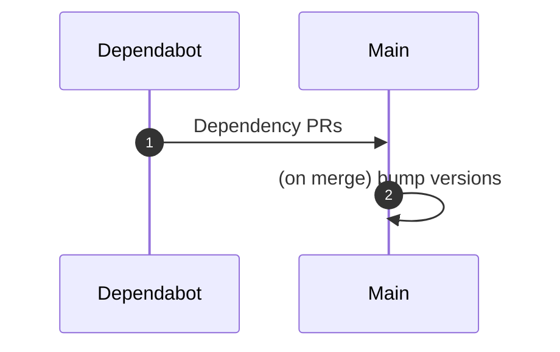
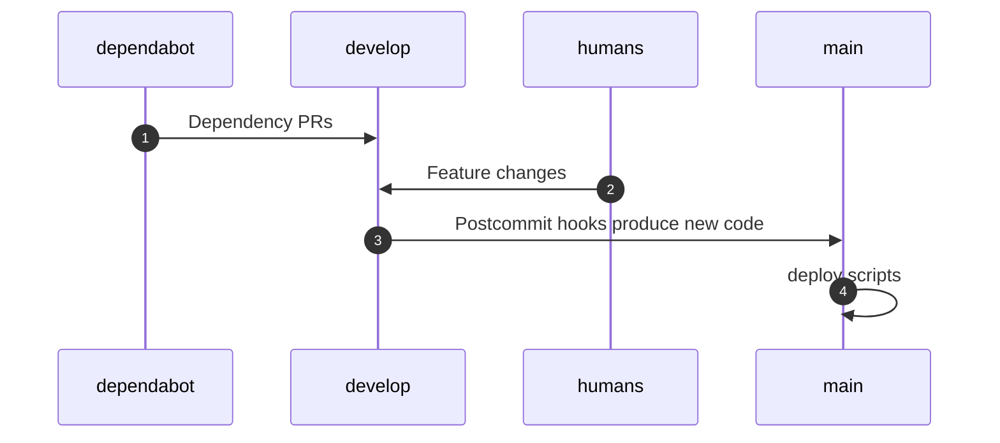

# Versioning

A core goal of this monorepo project was to be able to update more frequently the various packages I've developed over time, especially when it comes to updates. I don't want to have to manually update package deps, I'd rather lean on dependabot to do it.

I've previously semi-managed this with [do-sync]: dependabot pull requests are automatically merged if all the tests pass, then, after the dependabot PR is merged, a github action stamps a new version on the repo and another action publishes it to NPM.

[do-sync]: https://github.com/Zemnmez/do-sync

The issues with this are two fold:

1. Github actions (with some restrictions) cannot be triggered by other github actions. It is not entirely clear if what seems to work works 100% of the time.

2. It does not scale. The github action that bumps the version only bumps it in the package.json at the root of the package. This monorepo should eventually have several packages.

## Solutions Considered

### Main-centric flow

In this initially considered approach, when commits are pushed to main, a job runs that bumps versions.

The main issue with this approach is that 'main' can't have tests that ensure that versions are correct, or the initial commit will not be possible. Secondarily, it's inelegant to have to separate out kinds of commits such that an infinite version bumping loop doesn't happen.

### Develop-to-main flow

In this alternative flow, instead of having a single deploy and test flow for the monorepo, there is a separate one for the 'main' branch and the 'develop' branch. The 'develop' branch is allowed to have incorrect version numbers, or exclude them completely, and only the main branch has version correctness checks.

When a new commit is pushed to 'develop', a new set of scripts, perhaps in '//.github:postpush' run, generating a new commit that is then pushed to main that contains version information. This is the one I want to go forward with.

## Process
### Introduce new 'versioned' branch
 - [x] Versioned branch copies over all commits from main branch
 - [x] Rule that can be run to bump a version when a set of hashed file(s) changes.
### Introduce new 'versioned tests'
 - [x] Versioned tests, which are able to determine if a major minor
       or patch version should be bumped as a result of a change, exist.

[svgshot publish pr]: https://github.com/zemn-me/monorepo/pull/274
